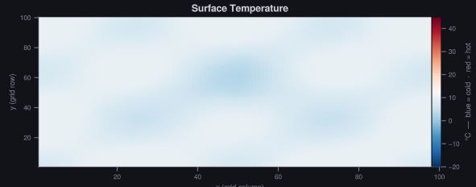
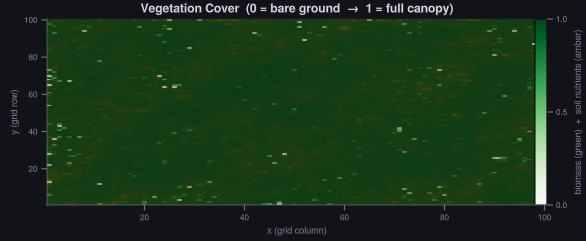
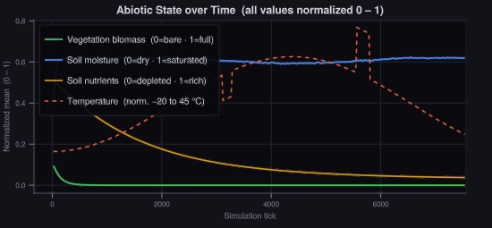
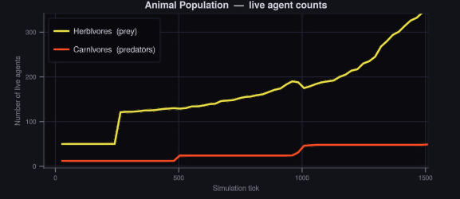
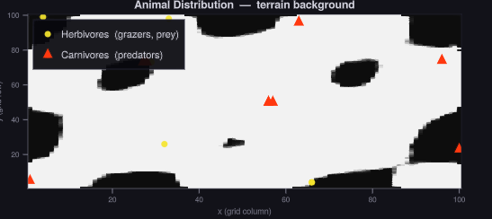
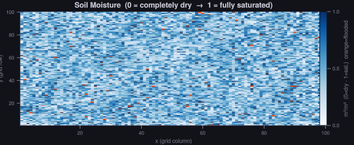

# Simsphere

A cell-based ecological simulation engine written in Julia. It models the interactions between climate, terrain, vegetation, and animal populations on a 2D grid. The simulation runs in real time with an interactive visualization window.

## What it simulates

- **Abiotic factors**: Temperature (daily and seasonal cycles, altitude lapse rate), water (rainfall, evaporation, diffusion, flooding), and soil nutrients
- **Vegetation**: Logistic growth modulated by water availability, temperature tolerance, and nutrient levels
- **Animals**: Herbivore and carnivore agents with energy, hunger, movement, breeding, and disease
- **Extreme events**: Heatwaves, droughts, frost, storms, wildfires, floods

## Requirements

- Julia 1.9 or newer
- Dependencies are listed in `Project.toml` and installed automatically

## Getting started

Install dependencies (first run only):

```
julia --project -e "using Pkg; Pkg.instantiate()"
```

Run with the interactive setup GUI:

```
julia main.jl
```

Run with a preset configuration:

```
julia main.jl configs/drought.toml
```

The GUI lets you adjust all parameters before the simulation starts. Once running, a visualization window shows real-time heatmaps of temperature, water, biomass, and animal positions.

## Presets

| File | Description |
|------|-------------|
| `configs/default.toml` | Temperate baseline |
| `configs/drought.toml` | Hot, dry conditions |
| `configs/tropics.toml` | Warm, high rainfall |
| `configs/ice_age.toml` | Cold, sparse growth |
| `configs/climate_change.toml` | Unstable temperature and rainfall |

## Output

At the end of each run, two CSV files are written to `data/output/`:

- `final_timeseries.csv` — per-tick means for temperature, water, biomass, nutrients, flood cells, herbivore count, carnivore count
- `final_timeseries_events.csv` — log of triggered extreme events (tick, type, intensity)

## Screenshots

The following screenshots were taken from a default simulation run.

**Surface temperature**


**Vegetation cover and soil nutrients**


**Abiotic state over time**


**Animal population over time**


**Animal distribution**


**Soil state**


## Project structure

```
src/
  core/           Types, world generation, simulation loop
  physics/        Temperature and water models
  biology/        Vegetation growth, animal agents
  events/         Extreme weather events
  scenarios/      Named parameter presets
  visualization/  GLMakie GUI and real-time renderer
  io/             CSV export
configs/          TOML configuration files
data/output/      Simulation output (CSV)
```

## Configuration

All parameters are set in a TOML file or via the GUI. Key groups:

| Group | Key parameters |
|-------|---------------|
| Grid | `width`, `height` |
| Climate | `base_temp`, `temp_amplitude_daily`, `temp_amplitude_seasonal`, `lapse_rate` |
| Water | `rain_probability`, `rain_amount`, `evaporation_rate` |
| Vegetation | `growth_rate`, `carrying_capacity`, `water_threshold`, `temp_opt` |
| Fauna | `max_herbivores`, `max_carnivores` |
| Simulation | `ticks_per_day` (default: 24), `ticks_per_year` (default: 8760) |
